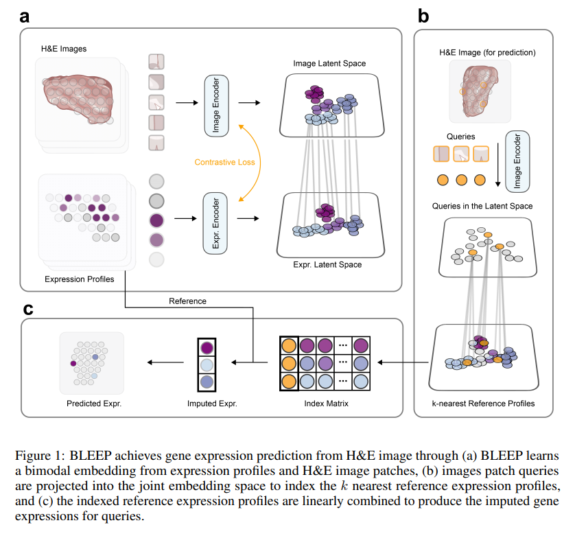

# BLEEP (Bi-modaL Embedding for Expression Prediction)
Spatially Resolved Gene Expression Prediction from H&E Histology Images via Bi-modal Contrastive Learning

Manuscript: 
https://proceedings.neurips.cc/paper_files/paper/2023/hash/df656d6ed77b565e8dcdfbf568aead0a-Abstract-Conference.html

We present BLEEP (Bi-modaL Embedding for Expression Prediction), a bi-modal
embedding framework capable of generating spatially resolved gene expression
profiles of whole-slide Hematoxylin and eosin (H&E) stained histology images.
BLEEP uses a contrastive learning framework to construct a low-dimensional
joint embedding space from a reference dataset using paired image and expression
profiles at micrometer resolution. With this framework, the gene expression of any
query image patch can be imputed using the expression profiles from the reference
dataset.

    

